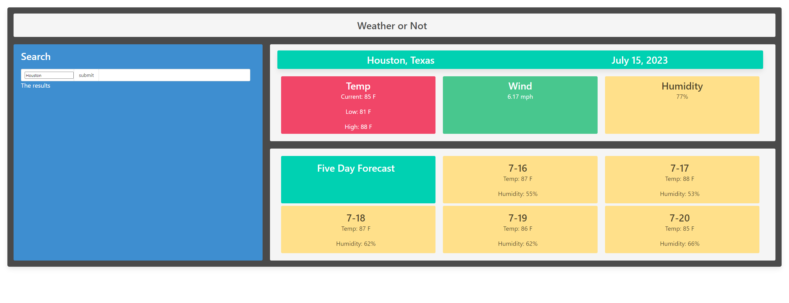
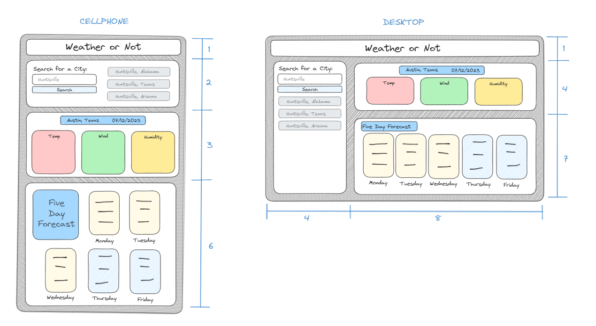

# simple-weather-dashboard
 a simple weather dashboard to see the forecast in a given area

## Description

- What was your motivation? To make a simple weather app
- Why did you build this project? To learn how to implement JavaScript, CSS, and HTML together
- What problem does it solve? The need for weather info
- What did you learn?  How to compress code and how to utilize API's

## Screenshot

## Link

[Website link] (https://drprofdavis.github.io/simple-weather-dashboard/)
[GitHub link] (https://github.com/DrProfDavis/simple-weather-dashboard)

## Credits

Shawn Davis